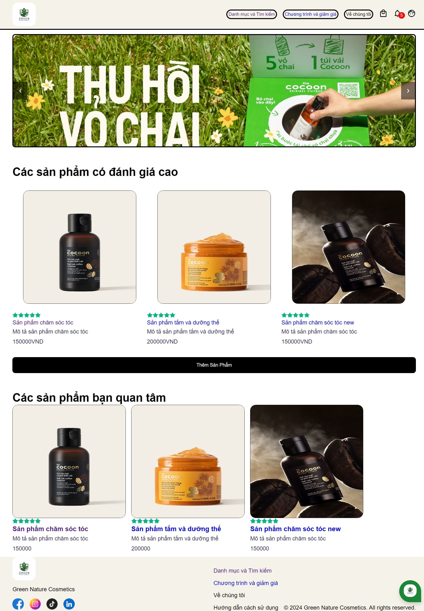
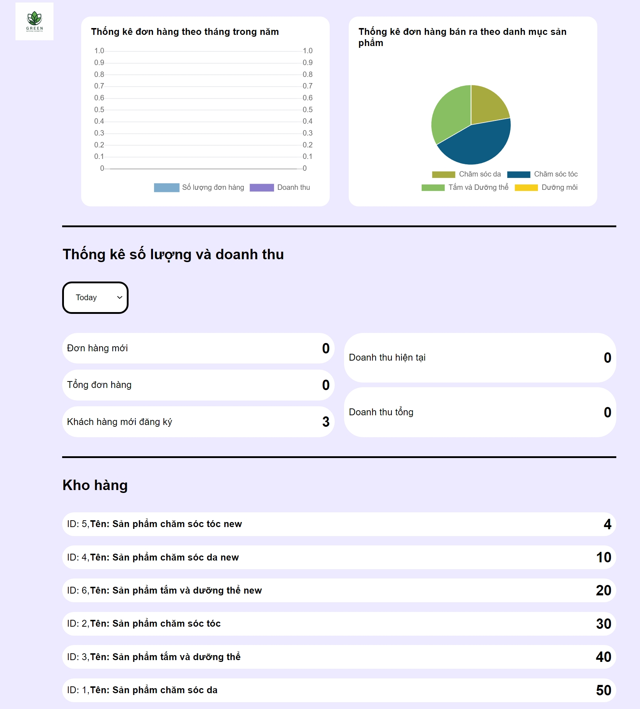

![Logo của dự án] "")

# Dự án: Thiết kế và Phát triển Website Bán Hàng Mỹ Phẩm

### Người thực hiện:  
**Đỗ Văn Quốc** - Sinh viên ngành Hệ thống Thông tin tại **Trường Đại học Nông Lâm TP.HCM (NLU)**.  

---

### Giới thiệu:  
Dự án "Ứng dụng framework Laravel và Figma trong thiết kế và phát triển website bán hàng mỹ phẩm" được triển khai từ **tháng 5/2024 đến tháng 10/2024** nhằm đáp ứng nhu cầu ngày càng tăng cao của thị trường mỹ phẩm trực tuyến. Mục tiêu chính là cung cấp một giải pháp hiện đại, hiệu quả để thay thế và khắc phục những hạn chế của mô hình bán hàng truyền thống.  

---

### Phương pháp và Công nghệ:  
- **Laravel Framework:** Áp dụng mô hình phát triển MVC để đảm bảo kiến trúc hệ thống chặt chẽ và khả năng mở rộng cao.  
- **Figma:** Tận dụng công cụ thiết kế giao diện hàng đầu để tạo ra các bố cục trực quan, chuyên nghiệp, dễ dàng chuyển đổi thành mã nguồn.  
- **Quy trình thực hiện:**
  - Phân tích thị trường để xác định nhu cầu và chức năng trọng yếu.
  - Xây dựng luồng hoạt động và thiết kế giao diện bằng Figma.
  - Tích hợp các công nghệ tiên tiến như **thanh toán VNPAY** và **chatbot AI** để nâng cao trải nghiệm người dùng.  
  - Xây dựng cơ sở dữ liệu và phát triển toàn bộ hệ thống.

---

### Thành tựu:  
Dự án đã hoàn thiện một website bán hàng mỹ phẩm trực tuyến với các đặc điểm nổi bật:  
- **Giao diện đơn giản, dễ sử dụng**, phù hợp với mọi đối tượng khách hàng.  
- **Danh mục sản phẩm đa dạng** với đầy đủ thông tin chi tiết.  
- Hỗ trợ thanh toán trực tuyến tiện lợi và tích hợp chatbot AI thông minh.  

Website không chỉ là một nền tảng bán hàng mà còn là một công cụ hỗ trợ doanh nghiệp trong việc cải thiện tương tác với khách hàng và tối ưu hóa hiệu quả kinh doanh.

---

### Cách thức thiết lập và chạy dự án [version VIETNAMESE]:

1. **Cài đặt môi trường phát triển:**
   - Tải và cài đặt **Visual Studio Code**: [Download](https://code.visualstudio.com/download)  
   - Tải và cài đặt **XAMPP**: [Download](https://www.apachefriends.org/download.html)  

2. **Khởi động XAMPP:**
   - Mở XAMPP, bật **Apache** và **MySQL**.  
   - Truy cập **phpMyAdmin** tại [http://localhost/phpmyadmin](http://localhost/phpmyadmin).  

3. **Thiết lập cơ sở dữ liệu:**
   - Tạo cơ sở dữ liệu mới có tên là **webeco**.  
   - Chọn chức năng **Nhập** để tải dữ liệu từ file `databasewebeco.sql` (thư mục: `database/data`).  

4. **Tải mã nguồn dự án:**
   - **Cách 1:** Tải trực tiếp từ GitHub: [mywebeco repository](https://github.com/20166016student/mywebeco.git).  
   - **Cách 2:** Sử dụng lệnh Git (nếu đã cài Git trên máy):  
     ```bash
     git clone https://github.com/20166016student/mywebeco.git
     ```

5. **Chạy dự án:**
   - Mở terminal trong Visual Studio Code, điều hướng đến thư mục dự án và chạy lệnh:  
     ```bash
     php artisan serve
     ```  

6. **Truy cập website:**
   - Giao diện khách hàng: [http://127.0.0.1:8000/home](http://127.0.0.1:8000/home).  
   - Giao diện quản lý: [http://127.0.0.1:8000/admin/dashboard](http://127.0.0.1:8000/admin/dashboard).  

### Setup and Run Instructions [version ENGLISH]:

1. **Set up the development environment:**
   - Download and install **Visual Studio Code**: [Download](https://code.visualstudio.com/download)  
   - Download and install **XAMPP**: [Download](https://www.apachefriends.org/download.html)  

2. **Start XAMPP:**
   - Launch XAMPP and activate **Apache** and **MySQL**.  
   - Access **phpMyAdmin** via [http://localhost/phpmyadmin](http://localhost/phpmyadmin).  

3. **Configure the database:**
   - Create a new database named **webeco**.  
   - Use the **Import** feature to upload data from the `databasewebeco.sql` file (located in `database/data`).  

4. **Download the source code:**
   - **Option 1:** Direct download from GitHub: [mywebeco repository](https://github.com/20166016student/mywebeco.git).  
   - **Option 2:** Use Git command (if Git is installed on your computer):  
     ```bash
     git clone https://github.com/20166016student/mywebeco.git
     ```

5. **Run the project:**
   - Open a terminal in Visual Studio Code, navigate to the project folder, and execute:  
     ```bash
     php artisan serve
     ```  

6. **Access the website:**
   - Customer interface: [http://127.0.0.1:8000/home](http://127.0.0.1:8000/home).  
   - Admin interface: [http://127.0.0.1:8000/admin/dashboard](http://127.0.0.1:8000/admin/dashboard).

## Demo
Giao diện dành cho trang khách hàng

Giao diện trang dành cho admin

